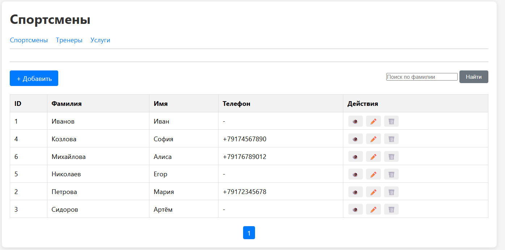
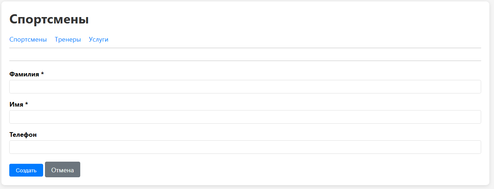
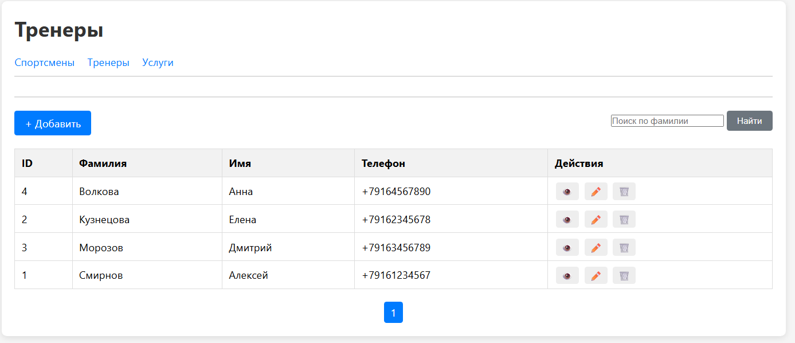
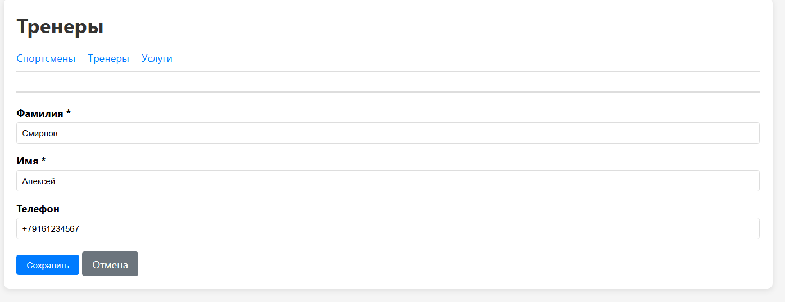
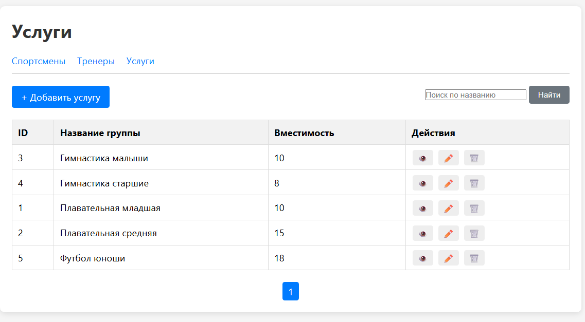
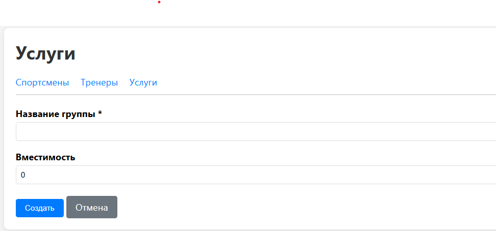

# Отчёт по практической работе

## Проектирование и реализация пользовательского интерфейса. Часть 1 (Справочники)

**Студент:** Выдрина Виктория  
**Группа:** 09.02.09  
**Вариант:** 8  
**Дата выполнения:** 20.05.2026

---

## 1. Цель работы

Разработать веб-интерфейс для управления справочными данными системы онлайн-записи в спортшколу. Реализовать CRUD-операции (создание, чтение, редактирование, удаление) для трёх справочников: Спортсмены, Тренеры, Услуги.

---

## 2. Что было сделано

Разработана архитектура приложения на основе Front Controller. Создан файл index.php, который обрабатывает все запросы. Реализован универсальный контроллер CrudController, который работает с любым справочником. Использованы ранее созданные репозитории AthleteRepository, CoachRepository и SportGroupRepository для работы с базой данных.

Созданы шаблоны: общий файл layout.php и отдельные файлы для списка, формы, удаления и просмотра. Для каждого справочника реализованы операции: просмотр списка записей, добавление новой записи, редактирование существующей, удаление с подтверждением, поиск по фамилии или названию.

Добавлены общие элементы интерфейса: меню для переключения между справочниками, пагинация (10 записей на страницу), flash-сообщения об успешных операциях и ошибках. Разработаны CSS-стили для адаптивной вёрстки, оформления таблиц и форм.

Обеспечена безопасность: все данные экранируются через htmlspecialchars, используются подготовленные выражения PDO, на сервере проверяются обязательные поля.

---

## 3. Результат работы

Разработано веб-приложение, доступное по адресу http://a92371k6.beget.tech/index.php?entity=athletes&action=list. Все три справочника работают корректно: данные создаются, редактируются, удаляются и ищутся.

Код загружен в репозиторий GitHub по адресу https://github.com/wudroow/online-booking-db-variant-08.

---

## 4. Скриншоты работы

### Спортсмены

**Список спортсменов**

**Форма добавления спортсмена**

### Тренеры

**Список тренеров**

**Форма редактирования тренера**

### Услуги

**Список услуг**

**Форма добавления услуги**

---

## 5. Проблемы и их решение

При разработке возникла проблема с отображением пагинации в справочнике услуг — она находилась сверху таблицы. Проблема решена перемещением блока пагинации в файле list_groups.php после закрывающего тега таблицы.

Также не работало меню переключения между справочниками. Причина была в том, что для услуг напрямую подключался файл list_groups.php в обход layout.php. Исправление внесено в метод listAction контроллера — теперь все сущности используют общий шаблон layout.php.

---

## 6. Вывод

Работа выполнена в полном объёме. Реализованы три справочника с полным CRUD, поиском и пагинацией. Интерфейс адаптивный, данные защищены от XSS и SQL-инъекций. Получен практический опыт разработки веб-интерфейса на PHP с использованием паттерна MVC.

**Студент:** Выдрина В.  
**Дата сдачи:** 20.05.2026
