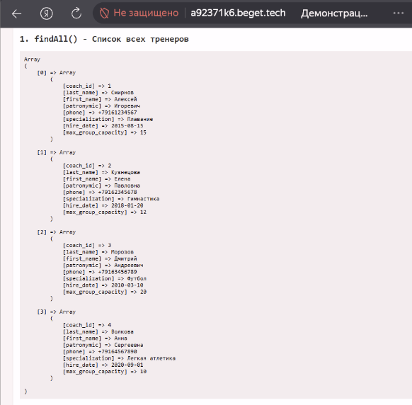
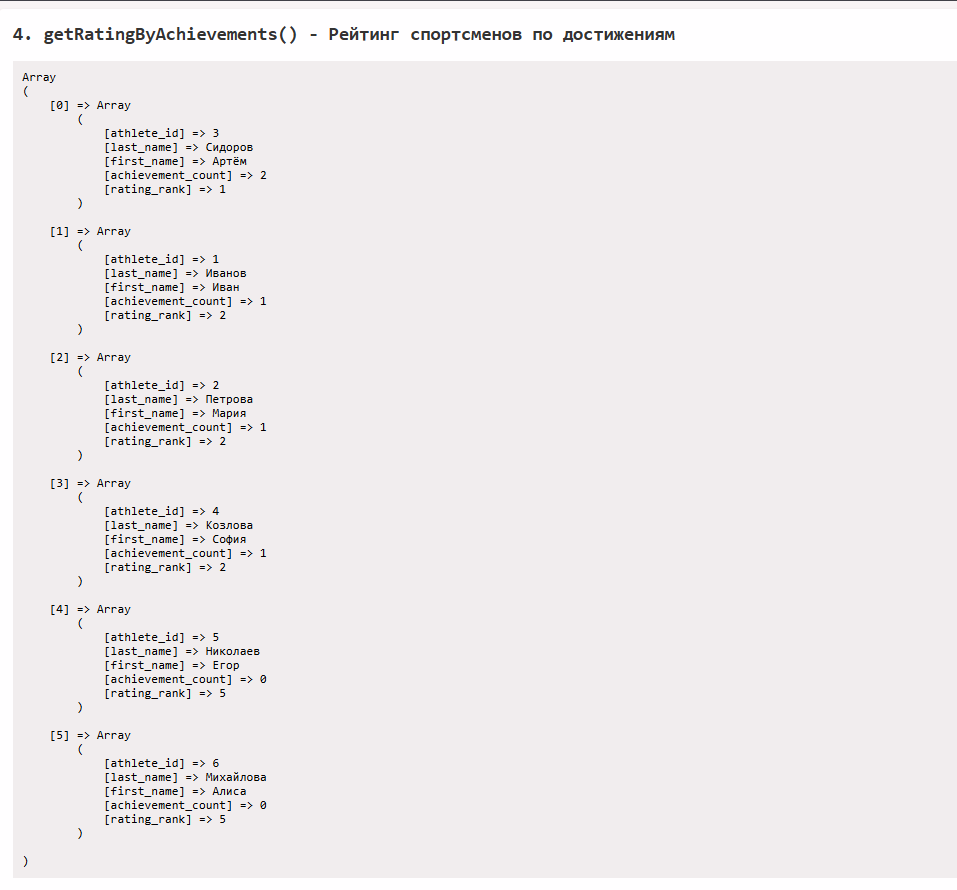
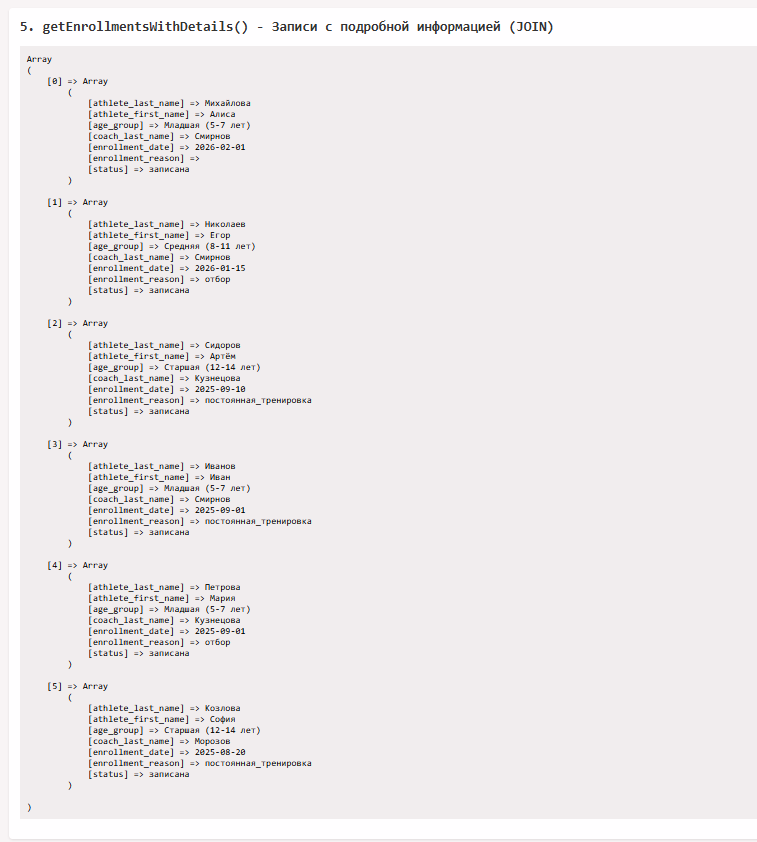
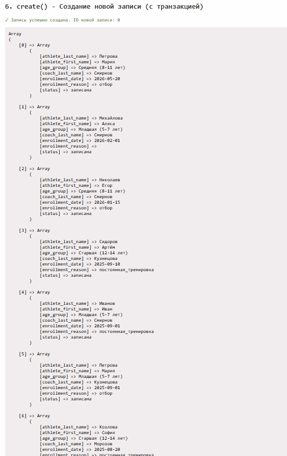
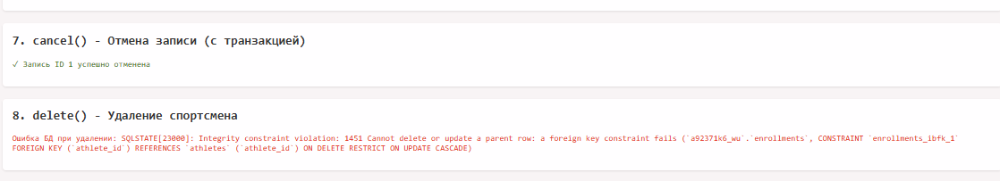

# Отчёт по работе «Разработка и реализация уровня доступа к данным»

**Студент:** Выдрина Виктория  
**Группа:** 09.02.09  
**Вариант:** 8  
**Дата:** 19.05.2026

---

## Архитектура уровня доступа к данным

Реализован паттерн Repository. Классы: Database (Singleton), AbstractRepository, CoachRepository, AthleteRepository, EnrollmentRepository.

---

## Защита от SQL-инъекций

Используются подготовленные выражения PDO. Переменные передаются через плейсхолдеры :name.

---

## Транзакции

Реализованы в методах create и cancel репозитория EnrollmentRepository.

---

## Демонстрация работы

Скриншот 1. findAll() и findById()

Скриншот 2. getRatingByAchievements() - рейтинг спортсменов

Скриншот 3. JOIN-запрос getEnrollmentsWithDetails()

Скриншот 4. Создание записи create() с транзакцией

Скриншот 5. Отмена записи cancel() и ошибка FOREIGN KEY

---

## Итог

Все методы работают корректно. Код протестирован на хостинге Beget.