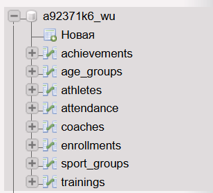
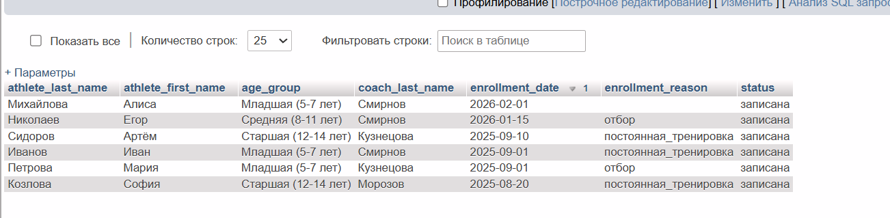
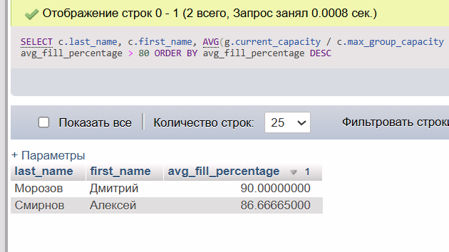
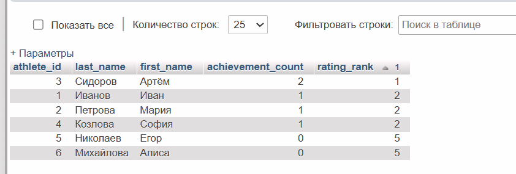
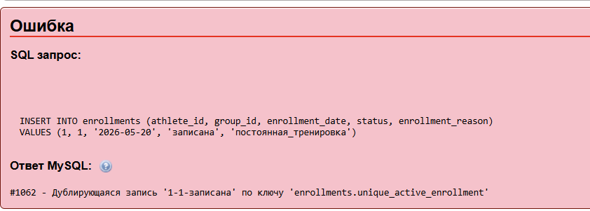
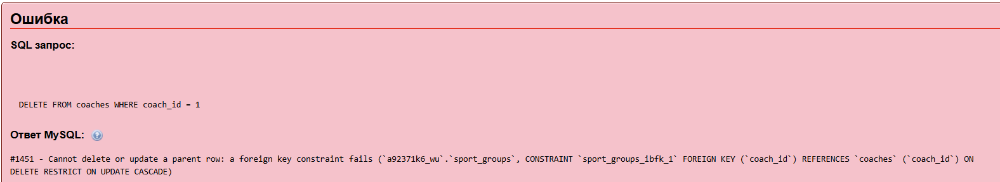
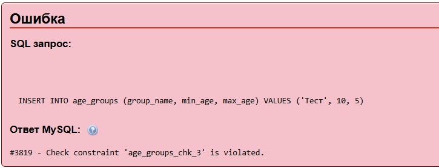

# Отчёт по практической работе

## Проектирование и создание схемы реляционной базы данных

**Тема:** Онлайн-запись в спортшколу  
**Вариант:** 8  
**Студент:** Выдрина Виктория  
**Группа:** 09.02.09  
**Дата:** 20.05.2026

---

## Раздел 1. Анализ предметной области

Система предназначена для онлайн-записи в спортшколу на отбор и постоянные тренировки. Основные бизнес-правила системы: тренеры ведут возрастные группы, ребёнок может быть записан только в одну группу одного тренера, возраст спортсмена должен соответствовать возрастной группе на момент записи. Дополнительно система хранит информацию о достижениях спортсменов, включая грамоты, дипломы, разряды и кубки. Тренер не может вести больше спортсменов, чем установленная для него максимальная вместимость группы.

---

## Раздел 2. Концептуальная модель

Выделены следующие сущности. Тренер характеризуется фамилией, именем, телефоном, специализацией, датой найма и максимальной вместимостью группы. Возрастная группа характеризуется названием, минимальным и максимальным возрастом. Спортсмен характеризуется фамилией, именем, датой рождения, телефоном родителя и медицинской пометкой. Группа связывает тренера и возрастную группу, содержит название группы и текущую наполняемость. Запись в группу содержит дату записи, статус и причину записи. Достижение содержит тип, название и дату выдачи. Тренировка содержит дату и время, длительность и тему. Посещаемость связывает запись и тренировку с отметкой о присутствии.

Связи между сущностями: один тренер может вести несколько групп, одна возрастная группа может быть использована в нескольких группах, один спортсмен может иметь несколько записей и несколько достижений, одна группа может иметь несколько тренировок.

---

## Раздел 3. Логическая модель и нормализация

Все таблицы находятся в третьей нормальной форме. Первая нормальная форма соблюдена, так как все атрибуты атомарны. Вторая нормальная форма соблюдена, поскольку все неключевые атрибуты зависят от полного первичного ключа. Третья нормальная форма соблюдена, так как транзитивные зависимости отсутствуют.

Перечень таблиц и столбцов:

Таблица coaches: coach_id, last_name, first_name, patronymic, phone, specialization, hire_date, max_group_capacity.

Таблица age_groups: age_group_id, group_name, min_age, max_age.

Таблица athletes: athlete_id, last_name, first_name, patronymic, birth_date, phone, parent_phone, parent_email, medical_note, created_at.

Таблица sport_groups: group_id, coach_id, age_group_id, group_name, current_capacity, schedule_description.

Таблица enrollments: enrollment_id, athlete_id, group_id, enrollment_date, status, enrollment_reason, enrolled_at.

Таблица achievements: achievement_id, athlete_id, achievement_type, title, issue_date, rank_value.

Таблица trainings: training_id, group_id, training_datetime, duration_minutes, topic, attended_count.

Таблица attendance: attendance_id, enrollment_id, training_id, attended, reason_for_absence.

---

## Раздел 4. SQL-скрипт создания базы данных

Полный SQL-скрипт приведён в файле schema.sql в репозитории GitHub. Скрипт включает создание всех таблиц, внешних ключей, ограничений CHECK, UNIQUE, а также тестовые данные и три запроса.

Скриншот 1. Список таблиц после выполнения скрипта

---

## Раздел 5. Тестовые данные и примеры запросов

Запрос 1. JOIN трёх таблиц

Задача: вывести список всех записей с фамилиями спортсменов, названиями возрастных групп, фамилиями тренеров, датой записи, причиной и статусом.

Текст запроса:

USE a92371k6_wu;
SELECT a.last_name AS athlete_last_name, a.first_name AS athlete_first_name, ag.group_name AS age_group, c.last_name AS coach_last_name, e.enrollment_date, e.enrollment_reason, e.status FROM enrollments e JOIN athletes a ON e.athlete_id = a.athlete_id JOIN sport_groups g ON e.group_id = g.group_id JOIN coaches c ON g.coach_id = c.coach_id JOIN age_groups ag ON g.age_group_id = ag.age_group_id ORDER BY e.enrollment_date DESC;

Скриншот 2. Результат запроса 1

Запрос 2. Группировка с HAVING

Задача: вывести тренеров, у которых средняя заполняемость групп превышает 80 процентов.

Текст запроса:

USE a92371k6_wu;
SELECT c.last_name, c.first_name, AVG(g.current_capacity / c.max_group_capacity * 100) AS avg_fill_percentage FROM coaches c JOIN sport_groups g ON c.coach_id = g.coach_id GROUP BY c.coach_id HAVING avg_fill_percentage > 80 ORDER BY avg_fill_percentage DESC;

Скриншот 3. Результат запроса 2

Запрос 3. Оконная функция

Задача: построить рейтинг спортсменов по количеству достижений.

Текст запроса:

USE a92371k6_wu;
SELECT athlete_id, last_name, first_name, achievement_count, RANK() OVER (ORDER BY achievement_count DESC) AS rating_rank FROM (SELECT a.athlete_id, a.last_name, a.first_name, COUNT(ach.achievement_id) AS achievement_count FROM athletes a LEFT JOIN achievements ach ON a.athlete_id = ach.athlete_id GROUP BY a.athlete_id) AS athlete_stats ORDER BY rating_rank;

Скриншот 4. Результат запроса 3

---

## Раздел 6. Проверка ограничений целостности

Ошибка UNIQUE

Попытка записать одного спортсмена в ту же группу повторно.

Текст ошибочного запроса:

USE a92371k6_wu;
INSERT INTO enrollments (athlete_id, group_id, enrollment_date, status, enrollment_reason) VALUES (1, 1, '2026-05-20', 'записана', 'постоянная_тренировка');

Текст ошибки: #1062 - Дублирующаяся запись '1-1-записана' по ключу 'enrollments.unique_active_enrollment'

Скриншот 5. Ошибка UNIQUE

Ошибка FOREIGN KEY

Попытка удалить тренера, у которого есть активные группы.

Текст ошибочного запроса:

USE a92371k6_wu;
DELETE FROM coaches WHERE coach_id = 1;

Скриншот 6. Ошибка FOREIGN KEY

Ошибка CHECK

Попытка создать возрастную группу с некорректными значениями возраста.

Текст ошибочного запроса:

USE a92371k6_wu;
INSERT INTO age_groups (group_name, min_age, max_age) VALUES ('Тест', 10, 5);

Скриншот 7. Ошибка CHECK

---

## Раздел 7. Выводы

В ходе выполнения работы была спроектирована и реализована база данных для онлайн-записи в спортшколу. Основные сложности возникли при обходе ограничения Beget на команду DROP DATABASE и при работе с зарезервированным словом GROUPS. Схема полностью соответствует требованиям варианта 8: поддерживается уникальность записи спортсмена в одну группу, контроль заполняемости групп, учёт достижений.

Возможные улучшения: добавить триггер для автоматического обновления текущей наполняемости группы при создании или отмене записи, создать представление для сводки по группам с процентом заполнения.

Приобретённые навыки: проектирование реляционных баз данных, написание SQL-запросов с JOIN, HAVING и оконными функциями, работа с phpMyAdmin на хостинге Beget.

---

## Раздел 8. Список литературы

1. Документация MySQL 8.0. Официальный сайт MySQL.
2. Методическое пособие по проектированию баз данных.
3. GitHub Docs. Основы работы с репозиториями.

---

Дата выполнения: 19.05.2026